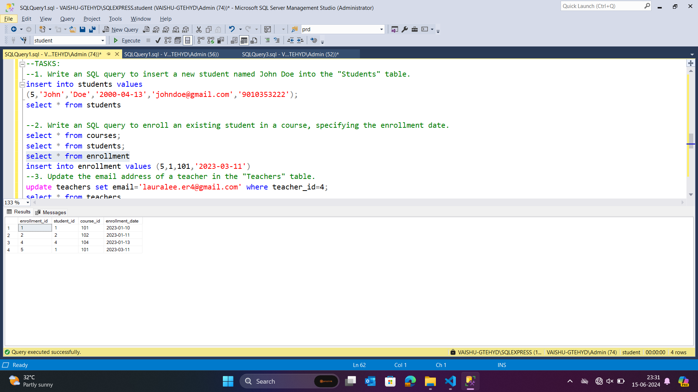
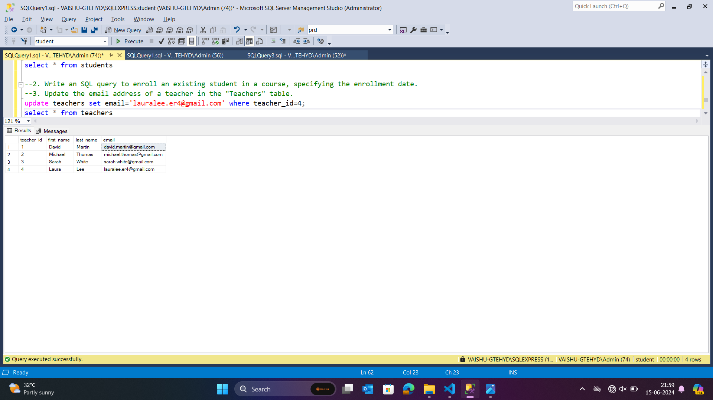
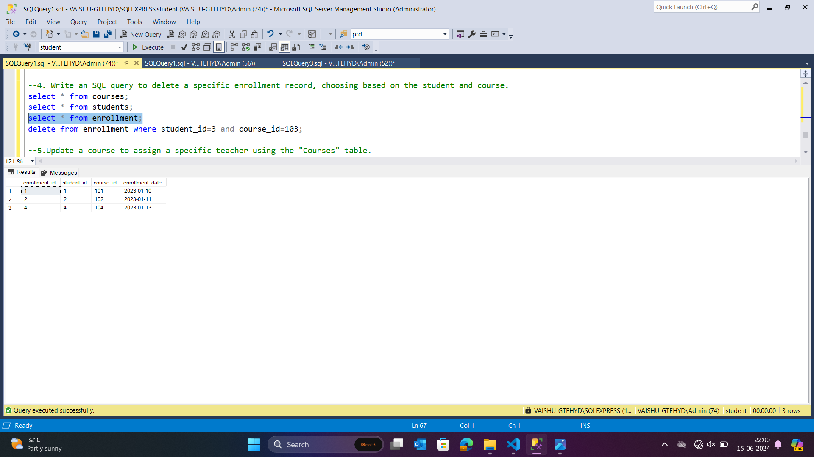
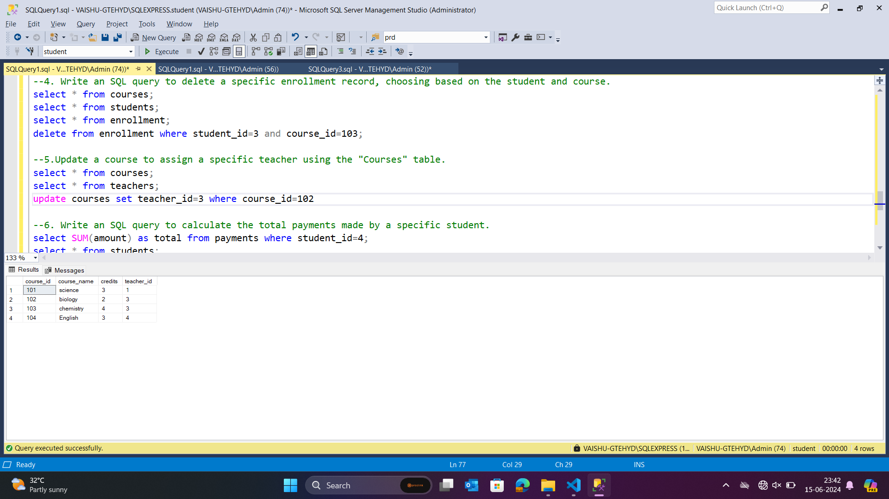
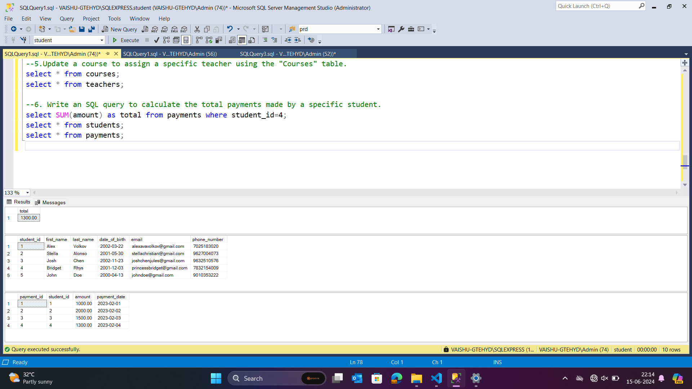
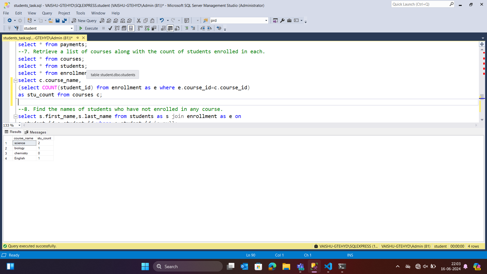
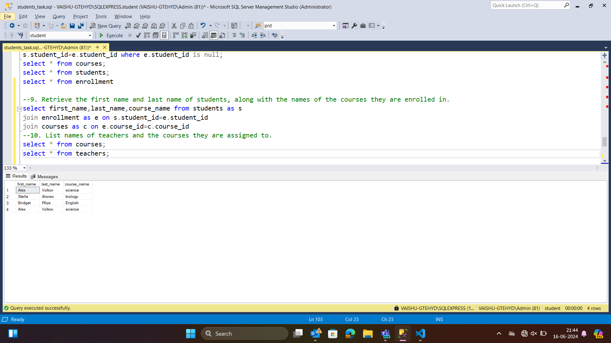
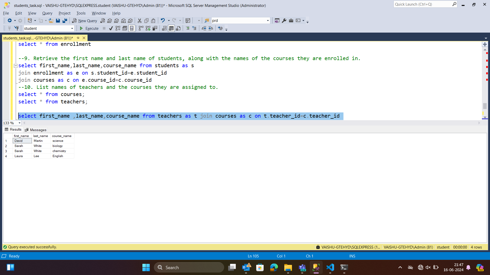

#### 1. Write an SQL query to insert a new student named John Doe into the "Students" table.

.png>)

#### Write an SQL query to enroll an existing student in a course, specifying the enrollment date.

#### 3. Update the email address of a teacher in the "Teachers" table.

#### 4. Write an SQL query to delete a specific enrollment record, choosing based on the student and course.

#### Update a course to assign a specific teacher using the "Courses" table.

#### 6. Write an SQL query to calculate the total payments made by a specific student.

#### 7. Retrieve a list of courses along with the count of students enrolled in each.

#### 9. Retrieve the first name and last name of students, along with the names of the courses they are enrolled in

#### 10. List names of teachers and the courses they are assigned to.
